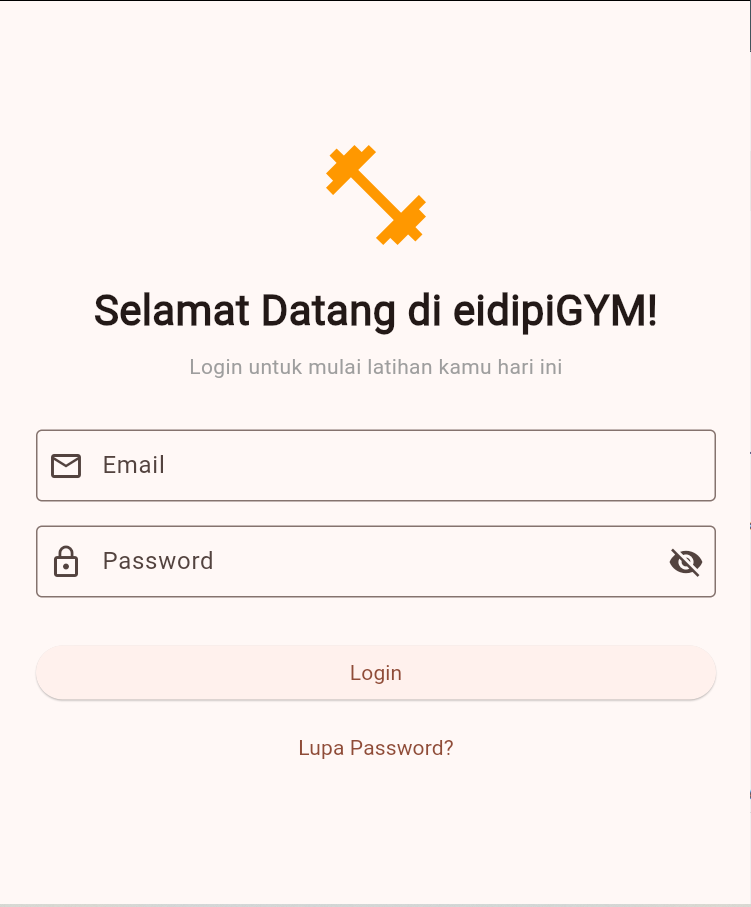
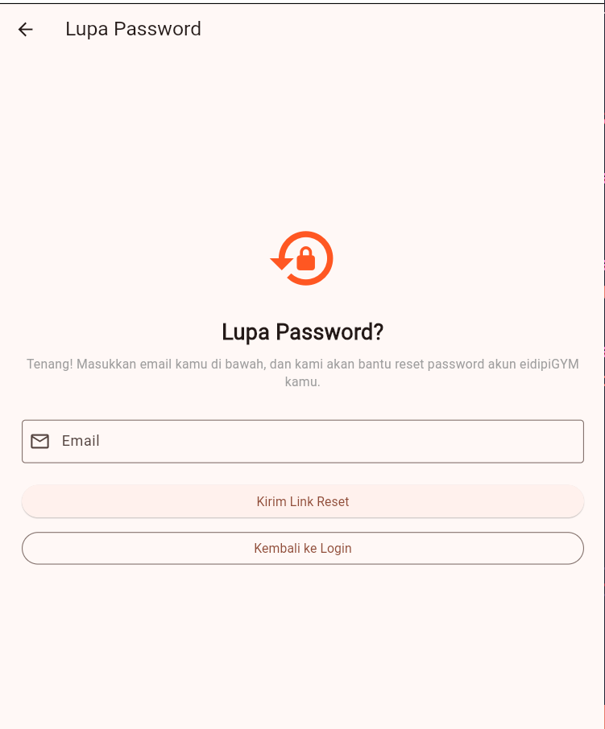
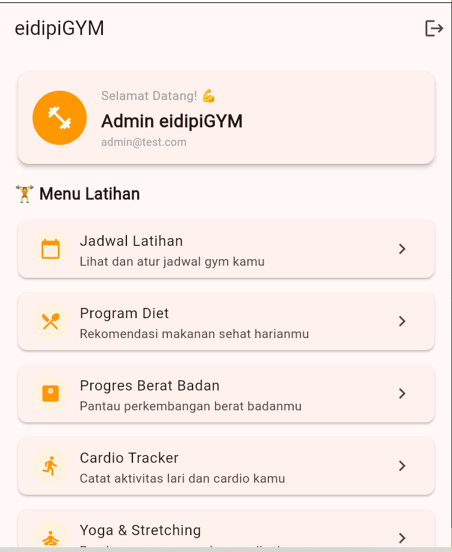

# UTS Mobile Programming — Flutter

Aplikasi Flutter 3 halaman yang dibuat sebagai tugas UTS mata kuliah Mobile Programming.

---

## 📱 Deskripsi Aplikasi

Aplikasi ini mensimulasikan alur autentikasi sederhana yang terdiri dari:
- Halaman Login dengan validasi form
- Halaman Lupa Password
- Halaman Dashboard setelah login berhasil

---

## ✨ Daftar Fitur

### Halaman Login
- Form input Email dan Password
- Validasi email (tidak boleh kosong, harus format email)
- Validasi password (tidak boleh kosong, minimal 8 karakter, harus mengandung huruf dan angka)
- Toggle show/hide password
- Loading indicator saat proses login
- Pesan error jika login gagal
- Navigasi ke halaman Lupa Password
- Login dengan kredensial: `admin@test.com` / `Admin123`

### Halaman Lupa Password
- Form input Email dengan validasi format email
- Loading indicator saat tombol ditekan
- Snackbar feedback setelah tombol ditekan
- Tombol kembali ke halaman Login

### Halaman Dashboard
- Tampilan data user yang sedang login
- Card sambutan dengan nama dan email user
- ListView 10 item menu dengan Card styling
- Snackbar saat item menu ditekan
- Dialog konfirmasi sebelum logout
- Logout menggunakan pushAndRemoveUntil

---

## 🚀 Cara Menjalankan Aplikasi


### Langkah-langkah

1. Clone repository ini
\```bash
git clone https://github.com/username/uts_mobile.git
\```

2. Masuk ke folder project
\```bash
cd uts_mobile
\```

3. Install semua package
\```bash
flutter pub get
\```

4. Jalankan aplikasi
\```bash
flutter run
\```

---

## 🔑 Kredensial Login

| Email | Password |
|-------|----------|
| admin@test.com | Admin123 |

---

## 📸 Screenshot

### Halaman Login


### Halaman Lupa Password


### Halaman Dashboard


---


---

## 📁 Struktur Folder
uts_mobile/
├── lib/
│   ├── main.dart
│   ├── screens/
│   │   ├── login_screen.dart
│   │   ├── forgot_password_screen.dart
│   │   └── dashboard_screen.dart
│   ├── widgets/
│   │   └── custom_button.dart
│   ├── models/
│   │   └── user_model.dart
│   └── utils/
│       └── validators.dart
├── screenshots/
│   ├── login.png
│   ├── forgot_password.png
│   └── dashboard.png
└── README.md